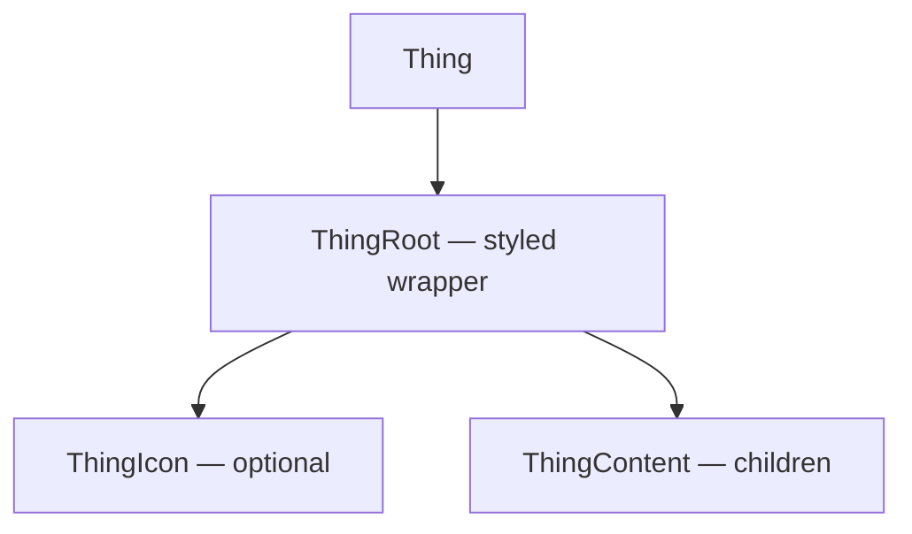

{/*
HOW TO USE THIS TEMPLATE
- Copy to docs/specs/<package-or-component>.mdx (kebab-case).
- Fill out every section. Delete sections only if truly N/A — and add a
  one-line note explaining why (e.g. "Anatomy: N/A — non-component package").
- This is a LIVING document. Update it in the same PR that changes the code.
- For components: most sections apply.
- For non-component packages (tokens, utils, hooks): skip Anatomy, States,
  Variants, RTL — keep API, Architecture, Implementation, Performance.
*/}

# `<package-or-component-name>`

| | |
|---|---|
| **Status** | Alpha · Beta · Stable |
| **Package** | `@bloom/<name>` |
| **Version** | `0.0.0` |
| **Owners** | <names> |
| **Figma source** | [Figma frame URL](https://www.figma.com/file/...) |
| **Linked RFCs** | [RFC NNNN](../rfcs/NNNN-<slug>.md) |
| **Last reviewed** | YYYY-MM-DD |

> **Maturity legend:**
> **Alpha** = API may change without notice. Not for production.
> **Beta** = API mostly stable; breaking changes will go through a deprecation cycle.
> **Stable** = Semver-protected. Breaking changes require a major bump and migration guide.

---

## 1. Overview

{/* What is this and why does it exist? One paragraph. */}

## 2. At a glance

{/* Minimum install + smallest meaningful usage example. Should be copy-pasteable. */}

```bash
pnpm add @bloom/<name>
```

```tsx
import { Thing } from '@bloom/<name>';

<Thing prop="value" />
```

## 3. Anatomy

{/* Components only. Embed the Figma frame (use the share link with "Embed" or
the public file URL) showing the labeled visible parts. The part names below
must match the Figma layer names AND the prop / slot / CSS class names in code.
Skip this section for non-component packages. */}

**Figma:** [link to anatomy frame](https://www.figma.com/file/...)

| Part | Description |
| ---- | ----------- |
| `root` | Outer wrapper |
| `icon` | Optional leading icon |
| `label` | Primary text |
| `helper` | Secondary supporting text |

---

## 4. API

### 4.1 Exports

{/* Every named export and what it is. */}

| Export | Kind | Description |
|---|---|---|
| `Thing` | Component | Primary component |
| `ThingProps` | Type | Props type |
| `useThing` | Hook | Imperative escape hatch |

### 4.2 Props

{/* Every prop. Mark required ones. Group related props with sub-headings if many. */}

| Prop | Type | Default | Required | Description |
| ---- | ---- | ------- | -------- | ----------- |
| `value` | `string` | — | Yes | ... |
| `variant` | `'primary' \| 'secondary'` | `'primary'` | No | ... |
| `disabled` | `boolean` | `false` | No | ... |
| `onChange` | `(value: string) => void` | — | No | Fires on every change |

### 4.3 Imperative API (refs)

{/* If forwardRef'd, what does the ref expose? */}

```ts
type ThingRef = {
  focus(): void;
  blur(): void;
};
```

### 4.4 Compound composition

{/* If this component has subcomponents (e.g. <Card.Header>), document the
contract here. Which subcomponents must appear? What's the order? */}

```tsx
<Card>
  <Card.Header />   {/* required */}
  <Card.Body />     {/* required */}
  <Card.Footer />   {/* optional */}
</Card>
```

### 4.5 Polymorphism (`as` prop)

{/* Does this support rendering as a different element? List allowed values
and what changes. */}

- `as="button"` (default) — receives `type`, `disabled`, etc.
- `as="a"` — receives `href`, becomes a link; ARIA role unchanged.

## 5. Usage examples

### 5.1 Basic
```tsx
<Thing value="hello" onChange={setValue} />
```

### 5.2 With variants
```tsx
<Thing variant="secondary" />
```

### 5.3 Controlled vs uncontrolled
{/* Document both modes if both supported. */}

---

## 6. Variants

{/* Visual variants. For each, describe when to use it. */}

| Variant | When to use |
|---|---|
| `primary` | The single most important action on a screen |
| `secondary` | Supporting actions |
| `ghost` | Tertiary, minimal visual weight |

## 7. States

{/* List the visual states this component supports and how a user reaches each.
Anything missing here is a state we forgot to design. */}

| State | Visual change | How reached |
|---|---|---|
| Default | — | Initial |
| Hover | Background +5% lightness | Pointer over |
| Focus | 2px ring, `--color-focus-ring` | Keyboard tab |
| Focus-visible | Ring shown only on keyboard nav | Tab key |
| Active | Background +10% lightness | Mouse down / Space |
| Disabled | 50% opacity, no pointer events | `disabled` prop |
| Loading | Spinner replaces children | `loading` prop |
| Error | Red border, error icon | `error` prop |

---

## 8. Behavior

### 8.1 Keyboard interactions

| Key | Action |
|---|---|
| `Tab` | Move focus in |
| `Shift+Tab` | Move focus out |
| `Enter` / `Space` | Activate |
| `Esc` | Close / cancel (if applicable) |

### 8.2 Pointer interactions

{/* Click targets, hit area, drag, long-press. */}

### 8.3 Focus management

{/* When opening/closing, where does focus go? Is focus trapped? Restored? */}

---

## 9. Accessibility

### 9.1 Role, name, value

| Aspect | Value |
|---|---|
| ARIA role | `button` (implicit) |
| Accessible name | `aria-label` or text content |
| ARIA states | `aria-disabled`, `aria-pressed` (toggle variant) |

### 9.2 Screen reader expectations

{/* What does VoiceOver / NVDA / TalkBack announce in each state? */}

- Default: "Save, button"
- Disabled: "Save, dimmed, button"
- Loading: "Save, busy, button"

### 9.3 WCAG 2.2 AA criteria addressed

- [ ] **1.4.3** Color contrast (text ≥ 4.5:1, large text ≥ 3:1)
- [ ] **1.4.11** Non-text contrast (focus ring ≥ 3:1)
- [ ] **2.1.1** Keyboard accessible
- [ ] **2.4.7** Focus visible
- [ ] **2.4.11** Focus not obscured (minimum)
- [ ] **2.5.8** Target size minimum (≥ 24×24 CSS px; aim for ≥ 44×44)
- [ ] **4.1.2** Name, role, value

### 9.4 Reduced motion

{/* If the component animates, how does it respect `prefers-reduced-motion`? */}

### 9.5 RTL support

{/* What flips, what doesn't, how is direction handled. */}

---

## 10. Cross-platform parity

{/* For Bloom: explicit web vs React Native behavior. Mark deliberate divergence with WHY. */}

| Concern | Web | React Native | Notes |
| ------- | --- | ------------ | ----- |
| Hover state | Yes | No | No hover on touch surfaces |
| Focus ring | Yes (keyboard only) | Yes (via `accessible`) | |
| Long press | No | Yes | RN-only feature |
| Animations | Yes (CSS transitions) | Yes (`Animated` API) | Same easing tokens |

---

## 11. Tokens consumed

{/* Every design token this component reads. When a token changes, this list
tells reviewers what to retest visually. */}

| Token | CSS property / RN prop | Role |
|---|---|---|
| `color.bg.primary` | `background-color` | Default background |
| `color.fg.on-primary` | `color` | Default text |
| `radius.md` | `border-radius` | Corner rounding |
| `space.300` | `padding` (Y) | Vertical padding |
| `space.400` | `padding` (X) | Horizontal padding |
| `motion.duration.fast` | `transition-duration` | Hover/active |

---

## 12. Architecture (HLD)

### 12.1 Internal composition

{/* Use a Mermaid diagram for internal structure — it renders on GitHub
and inside MDX. */}



### 12.2 Dependencies

| Dependency | Why |
|---|---|
| `@bloom/tokens` | Reads design tokens at build time |
| `react` | peer |

### 12.3 Build vs runtime

{/* What's resolved at build time? What at runtime? */}

---

## 13. Implementation (LLD)

### 13.1 File layout

```
packages/<name>/
├── package.json
├── src/
│   ├── index.ts             # public exports
│   ├── Thing.tsx            # component
│   ├── Thing.types.ts       # public types
│   ├── Thing.styles.ts      # styles (web) / RN equivalent
│   └── Thing.test.tsx       # tests
└── dist/                    # generated
```

### 13.2 Notable algorithms / trade-offs

{/* Anything non-obvious. Why we didn't use `useState` here, why we use `useLayoutEffect` there, etc. */}

### 13.3 Edge cases & error handling

- **What if both `loading` and `disabled` are true?** → `disabled` wins; loading spinner not shown.
- **What if `children` is null and no `aria-label`?** → Dev warning in non-prod.
- **What if `onChange` is undefined in controlled mode?** → ...

---

## 14. Performance

### 14.1 Render cost

{/* What does one render of this component cost? Big-O of internal work. */}

### 14.2 Re-render triggers

| Cause | Re-renders? | Mitigation |
|---|---|---|
| Parent re-render with same props | No | `React.memo` |
| `children` reference change | Yes | Document; consumer's responsibility |
| Theme context change | Yes | Expected |

### 14.3 Bundle size budget

| Metric | Budget | Current |
|---|---|---|
| ESM, gzipped | 2 KB | TBD |
| CJS, gzipped | 2.5 KB | TBD |

{/* Measure in CI with size-limit or similar. */}

### 14.4 Animation budget

{/* Frames, duration, easing tokens used. Justify anything over 300ms. */}

---

## 15. Testing strategy

| Layer | Tool | What's covered |
|---|---|---|
| Unit | Vitest | Pure logic, prop combinations |
| Integration | Testing Library | User interaction flows |
| Visual | Storybook + Chromatic | Every state × variant |
| Accessibility | axe-core, manual SR | WCAG criteria above |
| Cross-platform | Jest + RN Testing Library | Mirror critical web tests on RN |

**Intentionally not tested:** {/* and why */}

---

## 16. Design decisions

{/* A log of choices that weren't obvious. One entry per decision. */}

### Decision: <name> — YYYY-MM-DD

- **Context:** ...
- **Decision:** ...
- **Alternatives considered:**
  - **A:** ... — rejected because ...
  - **B:** ... — rejected because ...
- **Consequences:** ...

---

## 17. Versioning & changelog

{/* Notable API changes, deprecations, and migration notes per major version. */}

### v1.0.0 — YYYY-MM-DD
- Initial stable release.

---

## 18. Known limitations & future work

- [ ] ...

---

## 19. References

{/* External links: WAI-ARIA APG patterns, prior art (Material, Radix, Polaris), Figma files. */}

- [WAI-ARIA Authoring Practices: <pattern>](https://www.w3.org/WAI/ARIA/apg/patterns/)
- ...
