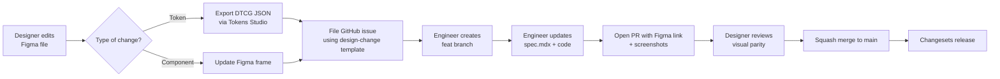

# Workflow

How design and engineering collaborate on Bloom. New contributors should read this first.

## Sources of truth

Bloom has two artifacts that must stay in sync. Each owns a different layer:

| Artifact                | Owns                                                             | Location                                         |
| ----------------------- | ---------------------------------------------------------------- | ------------------------------------------------ |
| Figma file              | Visual design — colors, spacing, anatomy, states, motion         | Figma (link in each spec under **Figma source**) |
| `docs/specs/<name>.mdx` | API, behavior, accessibility, performance, cross-platform parity | Repo                                             |

If the two ever disagree, that disagreement is a bug — track it in an issue and fix it in the same PR.

## Two workflows

Most changes start with the designer (Workflow A). Some start with the engineer (Workflow B). The rest of the loop is the same.

### Workflow A — Designer-led

Used for: new components, visual changes to existing components, token changes, new patterns.

Step-by-step:

1. **Designer designs** the change in Figma. For tokens, the change is exported as DTCG JSON via the Tokens Studio plugin.
2. **Designer files an issue** using the [design-change template](../.github/ISSUE_TEMPLATE/design-change.md). The issue includes the Figma frame URL, the type of change, and any cross-platform notes.
3. **An engineer picks up the issue**, creates a `feat/<slug>` or `fix/<slug>` branch, and implements the change.
4. **Engineer opens a PR**. The PR template requires the Figma URL and rendered screenshots — see the [PR template](../.github/pull_request_template.md). For component changes, screenshots from web AND React Native are required.
5. **Designer reviews the PR** for visual parity against the Figma source. Once Storybook + Chromatic are wired (later), this step uses Chromatic visual diffs; until then, designers compare screenshots in the PR description.
6. **Squash-merge to `main`.** The merge triggers a Changesets release.

### Workflow B — Engineer-led

Used for: bug fixes, performance work, accessibility fixes, refactors, build tooling.

1. **Engineer files an issue** (or skips straight to a PR for small fixes).
2. **Engineer opens a PR.**
3. **Reviewer rules:**
   - Pure code change with no visual impact → engineering review only.
   - Any visual or behavioral change → designer review required.
4. **Squash-merge to `main`.**

If at any point a Workflow B PR turns out to need a design decision, convert it: file a design-change issue, link it to the PR, and wait for the designer's input before merging.

## When does a change need an RFC?

An RFC is needed when the decision is **strategic and cross-cutting** — when it affects more than one package, sets a precedent, or has reasonable alternatives worth recording.

Examples that require an RFC:

- Adopting a new token spec or build tool.
- Changing how theming works.
- Introducing a pattern that other components will follow (e.g. compound component conventions).

Examples that do **not** require an RFC:

- Adding a single component (the spec covers it).
- Bug fixes.
- Refactors with no public API change.

The RFC is its own PR (`docs(rfc): ...`), merged before implementation begins. Implementation goes in a follow-up PR that references the accepted RFC.

## Tools

| Concern                       | Tool                                     |
| ----------------------------- | ---------------------------------------- |
| Visual design source of truth | Figma                                    |
| Token authoring               | Tokens Studio (Figma plugin) → DTCG JSON |
| Token build                   | Style Dictionary v4 (in `@bloom/tokens`) |
| Issue tracking                | GitHub Issues with templates             |
| Code review                   | GitHub PRs with template                 |
| Visual regression (planned)   | Storybook + Chromatic                    |
| Versioning & changelog        | Changesets                               |

## Approval and merge rules

- `main` is the release branch. All work happens on feature branches.
- Branch naming: `<type>/<short-slug>` — see the PR template for valid types.
- PR title follows Conventional Commits: `type(scope): subject`.
- Every PR is **squash-merged** so `main` has one commit per PR.
- Required reviews depend on what changed:
  - Visual / behavioral change → designer + engineer.
  - Code-only change → engineer only.
  - RFC → at least one engineer and one designer.
- Branch protection on `main` blocks direct pushes (set up in GitHub Settings → Branches).

## Release flow (summary)

When a PR merges to `main`:

1. Any package affected has a Changeset attached (created by the contributor via `pnpm changeset` during the PR).
2. A separate "Version Packages" PR opens automatically, bumping versions and updating changelogs.
3. Merging that PR publishes the affected packages to npm.

Detailed setup of Changesets + the release CI lives in its own RFC and spec (added when we wire it up).
